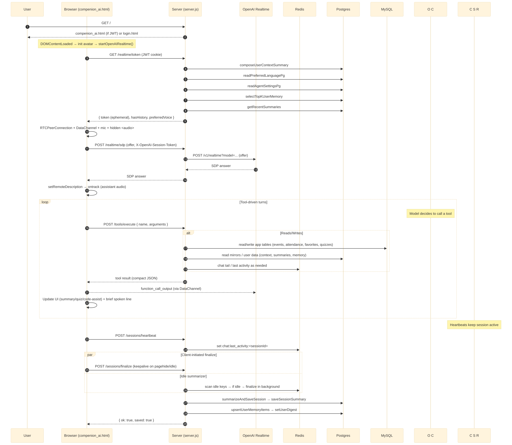
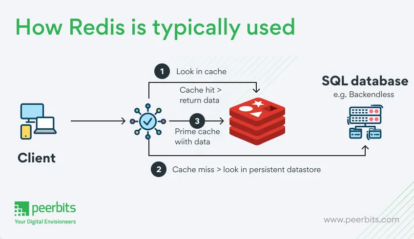

# Application Flow Overview 

## 1) Files & responsibilities
- `compenion_ai.html`: Single-page client. Owns WebRTC orchestration (`startOpenAIRealtime`), tools registry/handler, UI panels (summary/quiz/code‑assist), 3D avatar (`window.AvatarController`), lifecycle (heartbeats, finalize on idle/visibility, logout finalize), and mic/mute.
- `server.js`: Express server. Owns `/realtime/token` (instructions + ephemeral token), `/realtime/sdp` (WebRTC proxy), `POST /tools/execute` (all server tools), `/sessions/*` (heartbeat/finalize), auth (`/auth/*`), and static routes.
- `retrieval.js`: Postgres helpers. Chat JSON per (session_id,user_id), session summaries, user memory (facts/preferences/goals/progress/open questions), agent settings, and rolling digest.
- `redis.js`: Chat ring buffer (TTL + trimming) and session last‑activity keys for idle summarizer.
- `db/init.sql`, `db/mysql-init.sql`: Postgres schema/indexes for mirrors/app tables; MySQL source-of-truth app schema.
- `mysql.js`, `db.js`: connection helpers for MySQL and Postgres.

Term definitions
- WebRTC: browser‑native real‑time media/data stack that creates encrypted peer connections (audio/video/data).
- SDP (Session Description Protocol): plain‑text description of codecs, directions, ICE candidates, DTLS keys; browser sends Offer; OpenAI returns Answer.
- ICE (Interactive Connectivity Establishment): discovers viable network paths; includes STUN (public IP discovery) and optional TURN (relay).
- DTLS/SRTP: transport/security layers; DTLS protects SRTP media.
- DataChannel: bidirectional, low‑latency channel over WebRTC for tool messages (`oai-events`).
- Ephemeral token: short‑lived credential from `/realtime/token` (`client_secret.value`) that binds the session to server‑built `instructions`.

## 2) Entry points & startup
- server.js
  - GET / → if JWT cookie valid → serves `compenion_ai.html`, else `login.html`.
  - Auth endpoints: `/auth/register`, `/auth/login`, `/auth/logout` (sets/clears cookie `auth`).
- compenion_ai.html
  - On DOMContentLoaded: initializes the 3D avatar (visual only) and calls `startOpenAIRealtime()`.

Diagram:

## 3) Realtime session (browser ⇄ OpenAI via server)
1. Client calls `/realtime/token` → server builds per‑user `instructions` and returns an ephemeral `token`.
2. Client creates an `RTCPeerConnection`, a DataChannel (`oai-events`), attaches mic and hidden `<audio>` for playback.
3. Client `createOffer()` → waits for ICE complete → POSTs `/realtime/sdp` with header `X-OpenAI-Session-Token: token`.
4. Server proxies the offer to OpenAI → returns SDP answer → client `setRemoteDescription(answer)`.
5. DataChannel opens, `ontrack` starts remote audio, tools are registered.

## 4) Tool execution model
- Client registry: each tool has `name` + JSON `parameters`.
- Client handler: dedupes by `call_id`, accumulates streamed args, runs either:
  - Local action (avatar): `window.AvatarController.setWalk|setDance|setFight`.
  - Server action: POST `/tools/execute` { name, arguments } → echoes a compact result to the model and updates UI.
- Pacing: brief spoken line after tools; follow‑ups are debounced to avoid loops.

### Common tools (by category)
- Courses/catalog: `list_courses`, `recommend_courses`, `get_event_details`.
- Content: `get_event_summary` (HTML).
- Participation/favorites: `enter_event`, `user_favourite`.
- Quizzes: `get_event_quiz`, `submit_event_quiz`.
- Memory & preferences: `add_user_memory`, `get_user_memory`, `read/set_preferred_language`, `read/set_agent_name`, `read/set_agent_settings`.
- Client UI helpers: `open_code_assist_chat`, `update_code_assist_chat`.

## 5) UI surfaces (tool‑driven)
- Surface lifecycle pattern (consistent across panels)
  - Ensure: create or reuse the container (overlay/panel shell, close button, body area) and cache DOM refs.
  - Populate: fill content (title/body HTML, question/options, code/explanation) and wire events (Next/Prev/Submit, copy/close). Set enabled/selected state.
  - Open: make it visible (e.g., add `.open`), focus/scroll appropriately; optionally close other surfaces to avoid overlap.
- Summary overlay
  - Ensure + Populate + Open as above. Tool: `get_event_summary` provides the HTML body; if none, show a fallback message.
  - Presentation: the assistant speaks a 1–2 line highlight; the overlay carries the details. Commonly follows `get_event_details` or a direct “show summary.”
- Quiz modal
  - Ensure once (ensureQuizUI), then Populate per question with Next/Back/Submit logic (renderQuizQuestion), then Open for the target event.
  - Tools: `get_event_quiz` (fetch questions) and `submit_event_quiz` (grade + persist attempt/responses) with brief spoken coaching (no revealing answers).
- Code‑assist panel
  - Ensure a right-side drawer; Populate with a block: language, title, (optional) problem, code, explanation, next actions; wire copy buttons and highlighting; Open (slide in) and hide the launcher.
  - Tools: `open_code_assist_chat` (create block) and `update_code_assist_chat` (append/replace). Content is namespaced per user via `sessionStorage`.

## 6) Persistence & summarization
- During chat
  - Redis: `addChatTurn(sessionId, role, content)`, TTL + trim; `setSessionActivity` for idle tracking.
  - Postgres: `addChatMessage` stores an aggregated JSON array per (session_id,user_id).
- Finalization (client pagehide/idle or idle summarizer)
  - Server `summarizeAndSaveSession`:
    1) Assemble transcript (Postgres JSON → Redis → row logs fallback)
    2) Model summary → `saveSessionSummary`
    3) Extract atomic memory (guarded) → `upsertUserMemoryItems`
    4) Rebuild rolling digest → `setUserDigest`
  - Notes:
    - Client tries to finalize on pagehide/visibility/unload using keepalive/fallbacks; server idle summarizer finalizes if the client didn’t.
    - Memory extraction uses lightweight filtering to reduce hallucinations and preserve only durable user facts/preferences/goals/progress/questions.

##### Heartbeat (keepalive)
- The browser sends `POST /sessions/heartbeat` about every 30s with the current `sessionId` (see `compenion_ai.html`).
- The server updates Redis keys `chat:last_activity:<sessionId>` and `chat:session_user:<sessionId>` with a TTL (see `redis.js`).
- A background idle summarizer scans these keys and finalizes sessions that exceed `SESSION_IDLE_MS` of inactivity (see `server.js`).
- Related config: `SESSION_IDLE_MS`, `IDLE_SUMMARIZER_INTERVAL_MS`, `CHAT_BUFFER_TTL_SECONDS`.

##### TTL (Time-to-live) + trimming (chat buffer)
- Trimming: Redis list `chat:<sessionId>` keeps only the last `CHAT_BUFFER_MAX` items (`LTRIM`) so memory stays bounded.
- TTL: keys like `chat:<sessionId>`, `chat:last_activity:<sessionId>`, and `chat:session_user:<sessionId>` auto-expire after `CHAT_BUFFER_TTL_SECONDS`.
- Purpose: limit transient storage; Postgres remains the durable source of truth for summaries and history.

Redis (at a glance)
- Redis is an in‑memory key–value store we use for speed and ephemerality. It holds the recent chat tail (`chat:<sessionId>`) with trim + TTL and tracks session activity (`chat:last_activity:<sessionId>`, `chat:session_user:<sessionId>`) for the idle summarizer. Because keys expire, Redis is not the source of truth; Postgres stores the durable conversation history and summaries.

## 7) Extending safely
- New tool: add JSON schema in client registry → handle in client message loop → add server case in `/tools/execute` → (optional) render/update a panel.
- New data: add Postgres helpers in `retrieval.js` → read/write only via server → optionally expose in `/user/context`.
- New avatar behavior: add clip → extend `window.AvatarController` → reuse AnimationMixer + crossfade.
 - New UI surface: follow the panel pattern (self‑contained DOM, minimal spoken output, concise JSON payloads from tools).

## 8) Config that affects runtime
- OpenAI: `OPENAI_API_KEY`, `OPENAI_REALTIME_MODEL`, `OPENAI_SUMMARY_MODEL`.
- Timezone: `APP_TIMEZONE` (controls localized fields).
- Redis: `CHAT_BUFFER_MAX`, `CHAT_BUFFER_TTL_SECONDS`.
- Idle summarizer: `ENABLE_IDLE_SUMMARIZER`, `SESSION_IDLE_MS`, `IDLE_SUMMARIZER_INTERVAL_MS`.
 - Server ports/static: ensure TLS for WebRTC in production; narrow static mounts; use environment profiles.

## 9) Quick trace (putting it together)
“Open a quiz for event 42” → model calls `get_event_quiz` → client opens quiz modal → user submits → `submit_event_quiz` persists + returns score → short spoken result → session finalized later (summary + memory saved).

## 10) Realtime messaging model

Baseline vs per‑turn
- Baseline (server `instructions` in the ephemeral token): a session‑level “system” prompt that shapes behavior for all turns. It does not trigger a reply by itself.
- Per‑turn (`dc.send({ type: 'response.create', response: { instructions } })`): a turn‑level “user” prompt. It asks the model to answer now, while still obeying the baseline.
- If baseline and per‑turn disagree, the baseline generally wins; the per‑turn text still guides the specific reply.

Common realtime events
- `session.created` / `session.updated`: session is ready or its settings changed (e.g., voice).
- `response.created`: your `response.create` request was accepted; the model is starting a reply.
- `response.output_item.added`: a new output block (text/audio) is being produced for this response.
- `conversation.item.created`: the service logged an item to the conversation trace.
- `response.content_part.added`: a part of content (e.g., a text chunk) was added to the output.
- `response.audio_transcript.delta`: incremental transcript text for the audio being synthesized.
- `output_audio_buffer.started`: TTS audio buffering began for playback.
- `response.audio.done` / `response.content_part.done` / `response.output_item.done`: the respective audio/text/output block finished.
- `response.done`: the model finished the current turn.
- `rate_limits.updated`: updated usage/limits for the session.

Flow recap
1. Server mints token with baseline `instructions`.
2. Client sends `response.create` with per‑turn `instructions` (e.g., greeting/onboarding) → model replies immediately.
3. Subsequent turns come from tools or more `response.create` messages, each producing the stream of `response.*` events until `response.done`.

Persistence during realtime: After each user transcript and after an assistant reply finishes, the client calls `POST /tools/execute` with `{ name: 'add_chat_turn', arguments: { sessionId, role, content } }`. The server appends the turn to Redis list `chat:<sessionId>` (kept to the last `CHAT_BUFFER_MAX` items and expiring after `CHAT_BUFFER_TTL_SECONDS`) and simultaneously mirrors it to Postgres by updating the single aggregated JSON row in `chat_message` for `(session_id, user_id)`. It also refreshes `chat:last_activity:<sessionId>` so the idle summarizer can detect inactivity. Redis provides a fast, lossy buffer for recent context; Postgres is the durable source read later by `summarizeAndSaveSession`.
